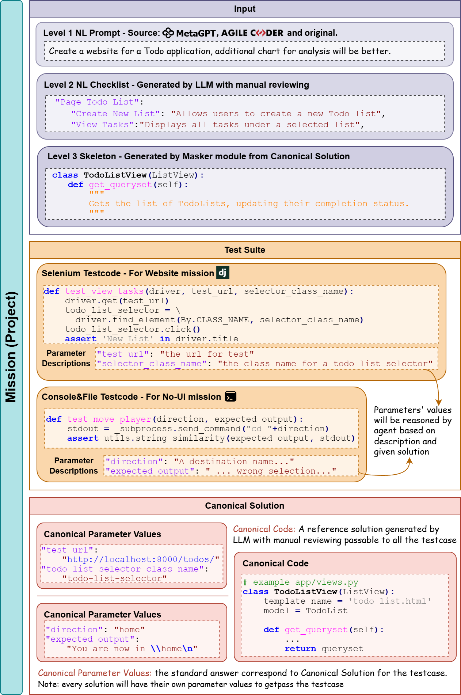
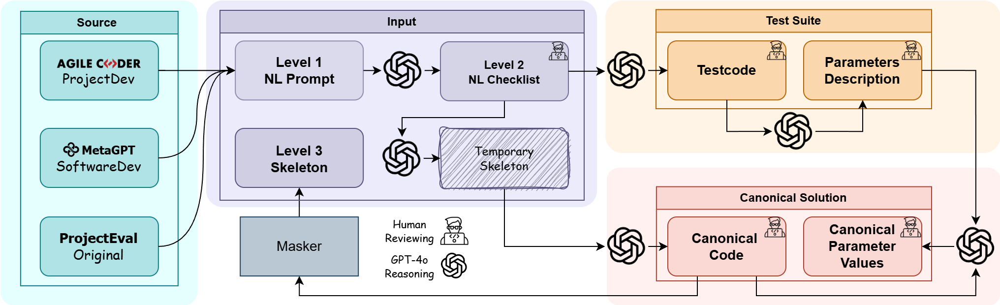
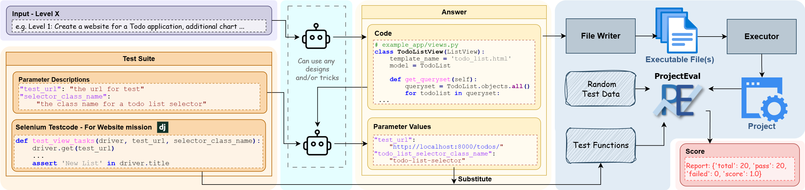

# ProjectEval: A Benchmark for Programming Agents Automated Evaluation on Project-Level Code Generation

[![Contributors][contributors-shield]][contributors-url]
[![Forks][forks-shield]][forks-url]
[![Stargazers][stars-shield]][stars-url]
[![Issues][issues-shield]][issues-url]
[![GPLv3 License][license-shield]][license-url]

[contributors-shield]: https://img.shields.io/github/contributors/RyanLoil/ProjectEval.svg?style=for-the-badge
[contributors-url]: https://github.com/RyanLoil/ProjectEval/graphs/contributors

[forks-shield]: https://img.shields.io/github/forks/RyanLoil/ProjectEval.svg?style=for-the-badge
[forks-url]: https://github.com/RyanLoil/ProjectEval/network/members

[stars-shield]: https://img.shields.io/github/stars/RyanLoil/ProjectEval.svg?style=for-the-badge
[stars-url]: https://github.com/RyanLoil/ProjectEval/stargazers

[issues-shield]: https://img.shields.io/github/issues/RyanLoil/ProjectEval.svg?style=for-the-badge
[issues-url]: https://github.com/RyanLoil/ProjectEval/issues

[license-shield]: https://img.shields.io/github/license/RyanLoil/ProjectEval.svg?style=for-the-badge&label=License
[license-url]: https://github.com/RyanLoil/ProjectEval/blob/main/LICENSE

🏆Leaderboard: [ProjectEval LeaderBoard](https://ryanloil.github.io/ProjectEval/)

📫Contact: [Kaiyuan Liu](mailto:1171000408@stu.hit.edu.cn)

# 📰News

- 2025/05/30 🚀ProjectEval Repository opensource.

- 2025/05/25 🚀ProjectEval Leaderboard online.

- 2025/05/16 🎉ProjectEval is accepted by ACL 2025 Findings.

# 👋Overview

- **ProjectEval** is a multi-level benchmark designed to evaluate LLMs and agents on *project-level code generation* through realistic user interactions. It aims to bridge the gap of lacking the ability to automatically evaluate code from users’ perspective, and also lacking the explainability of the results of LLM agents’ code generation capabilities. 

## Structure

- ProjectEval integrates **natural language**, **structured checklists**, and **code skeletons** as 3 different level inputs to simulate diverse development scenarios and support explainable evaluations. And it contains its standard Test Suite and Canonical Answer.



### Inputs

- **Level 1 - Natural Language Prompt (NL Prompt)**: the agent will receive one or several natural language sentences to describe the target of the project.

- **Level 2 - Natural Language Checklist (NL Checklist)**: the agent will receive a standard natural language checklist describing the project through the abilities and
  functions that the project should have.

- **Level 3 - Skeleton**: the agent will receive a skeleton of the standard answer which contains doc-strings and comments to describe the project inside.

### Test Suites

A mission test suite will contain two parts:

- **Testcodes**: a mission contains several automated evaluation Python functions similar to HumanEval testcases.

- **Parameter Description (PD)**: PD is used for a special kind of parameter alignment. These parameters are required by the matching testcode to achieve the established test goal(s).

### Canonical Answer

For every mission we constructed has a canonical solution, beside the canonical code, we also build every PD’s standard answer matching to the canonical code called canonical parameter values.

## Construction

Testcode is aligned with Checklist. Parameter Description is aligned with Testcode and Canonical Parameter Values. Canonical Parameter Values is aligned with Canonical Code and use for testcode to get passed.



## Evaluation



The evaluation process begins by selecting a specific level from the input and presenting it to the agent. The agent generates solution code. The solution code is then fed back into the same agent along with the parameter description. The agent is tasked with answering the parameter description based on its own solution to produce parameter values (PV). The code is then converted into an executable file, creating a tangible project. PV is a substitute to testcode, and testcode is integrated into the ProjectEval evaluation machine to obtain the evaluation results.

## Summary

Projecteval introduces automated evaluation tools and heterogeneous software verification systems, enabling fine-grained comparison of model outputs across semantically equivalent input formats. This provides deeper insight into a model understanding of end-to-end software development.

# 🚀Quickstart

## Requirements

- **Operating System**: ProjectEval works on both the Windows platform and the Linux platform. We didn't test macOS yet, but since it works fine on Linux, there should be no problem.

- **❗Browser and Driver** : ProjectEval needs a browser and its driver. We officially support three: Edge, Chrome, and Firefox. **For Windows platform: put the driver.exe into the root directory of ProjectEval.** For Linux platform, just follow the official way to add a drive service.

- ❗**Python Virtual Environments (venv)**:  ProjectEval asks you to use a virtual environment by using `python -m venv .venv`. If your venv path is NOT `.venv`, change the VENV_PATH to yours in `config.ini`.

- **LLM**: Make sure that your Ollama runs if you wish to run any models mentioned in our papers.

## Evaluation

### Preparation

ProjectEval standard evaluation only supports JSON. But you can easily transfer any text files into JSON by using `tools\file_transform.py` .

### Execution

If you trust your LLM that it won't do harm to your device, you can run the execution evaluation process by just using:

```shell
 python run_judge.py -r "[\"<your_folder_name_in_experiment>\"]"
```

If NOT, run a Docker by following the following steps:

```shell
# Step 1
cd docker

# Step 2
sh build.sh # Linux
build.bat # Windows

# Step 3
sh compose.sh # Linux
compose.bat # Windows
```

No matter which way you choose, all the results will be saved in the *experiments* directory.

### Objective Indicators

In the project root directory:

```shell
python run_indicators.py -r "[\"<your_folder_name_in_experiment>\"]"
```

The result will be in the *experiments* directory.

## Reasoning

ProjectEval is an offline evaluation benchmark and its evalutaion phase is complicated and time-costy. So the reasoning phase is separated from the evaluation phase. 
The reasoning phase only produces JSON or files.

Running a standard ProjectEval reasoning phase by:

1. Open the `run_reasoning.py`

2. Follow the instruction in the file by editing your own parameters.

3. `python run_reasoning.py`

## Generation

WARNING: THIS PHASE WILL INCUR COSTS.

ProjectEval used GPT-4o to generate the data. To reperform it:

```shell
python run_generation.py
```

# ❓Common Issues Checklist

This part is for some common issues that have been noticed by authors, check this before you submit an issue:

- [ ] The answer's path follows the example in the *experiments* directory.

- [ ] The answer's format follows the example in the *experiments* directory, and if you transfer the files into JSON by yourself, we strongly recommend that you use the script `file_transform.py` in the *tools* directory.

- [ ] `config.ini` is set correctly.

- [ ] Docker runs properly.

# 🖊Citation

```
@misc{liu2025projectevalbenchmarkprogrammingagents,
      title={ProjectEval: A Benchmark for Programming Agents Automated Evaluation on Project-Level Code Generation}, 
      author={Kaiyuan Liu and Youcheng Pan and Jing Li and Daojing He and Yang Xiang and Yexing Du and Tianrun Gao},
      year={2025},
      eprint={2503.07010},
      archivePrefix={arXiv},
      primaryClass={cs.SE},
      url={https://arxiv.org/abs/2503.07010}, 
}
```

# ❗Known Issues

- [ ] There is a request made during the execution evaluation. We are working on removing it.

# ☘Feature in Future

- [ ] Full explanation about the ProjectEval projects.

- [ ] Java Version Canonical Answer

- [ ] Leaderboard Update
